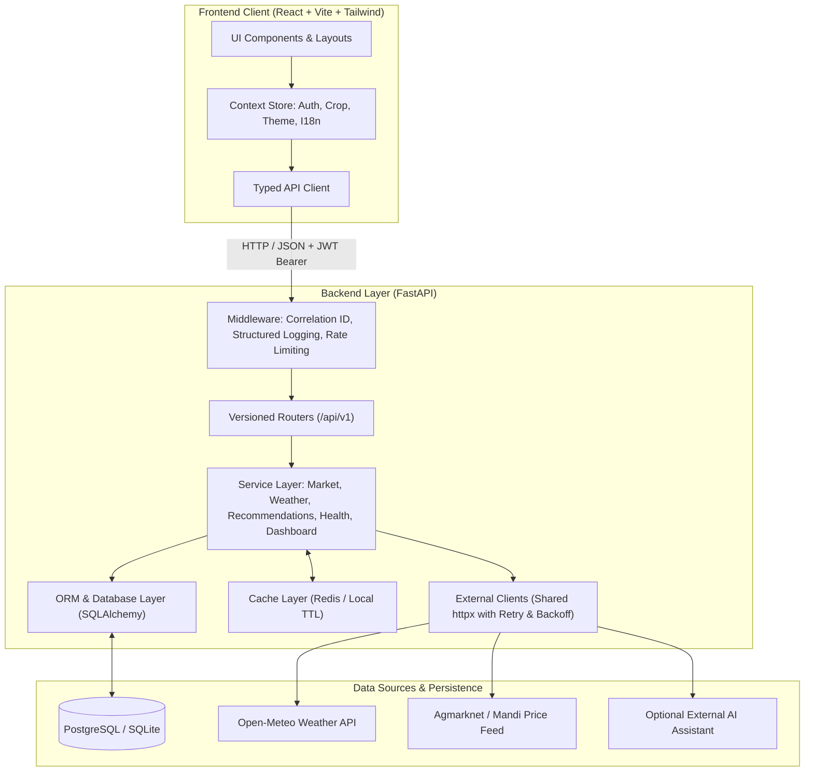

# 🌾 AgriSense AI — Agricultural Intelligence & Decision Support

[](https://agri-sense-ai-nine.vercel.app/)
[](https://agrisense-api-0p24.onrender.com/docs)
[](https://supabase.com)
[](https://www.python.org/)
[](https://fastapi.tiangolo.com/)
[](https://reactjs.org/)
[](https://www.typescriptlang.org/)
[](https://tailwindcss.com/)

🚀 **Live Web Application:** [https://agri-sense-ai-nine.vercel.app/](https://agri-sense-ai-nine.vercel.app/)  
⚡ **Interactive Swagger API Docs:** [https://agrisense-api-0p24.onrender.com/docs](https://agrisense-api-0p24.onrender.com/docs)  
🔑 **Demo Account:** `demo@agrisense.ai` | `Demo@1234`

---

## 📖 About The Project

**AgriSense AI** is a REST API-driven agricultural information and decision-support platform engineered for Indian farmers. It delivers season-aware crop management, normalized mandi (market) price intelligence with historical price trends, live weather forecasts with agro-advisories, educational disease/pest management, fertilizer guidance, a farmer marketplace, and transparent sell-or-hold decision support.

The backend acts as the central API orchestration layer, owning the database (PostgreSQL on Supabase), integrating external APIs (Open-Meteo weather, mandi prices, assistant), and serving a standardized REST contract to the bilingual (English & Hindi) React frontend.


---

## 📑 Table of Contents

- [📖 About The Project](#-about-the-project)
- [🌟 Key Features](#-key-features)
- [📸 Interface Tour](#-interface-tour)
- [🏛️ System Architecture](#-system-architecture)
- [🛠️ Technology Stack](#-technology-stack)
- [📂 Repository Structure](#-repository-structure)
- [🚀 How to Run Locally](#-how-to-run-locally)
- [⚙️ Environment Variables](#-environment-variables)
- [📡 API Overview](#-api-overview)
- [🧠 Key Workflows](#-key-workflows)
- [🗄️ Database Schema](#-database-schema)
- [🧪 Testing](#-testing)
- [⚠️ Disclaimers](#-disclaimers)

---

## 🌟 Key Features

| Capability | Description |
|---|---|
| **🌾 Season & Crop Catalog** | Database-driven catalog covering **Rabi** (wheat, chickpea, mustard, potato) and **Zaid/summer** (watermelon, cucumber, muskmelon, moong) crops with growing calendars. |
| **📈 Mandi Price Intelligence** | Normalized mandi price board (min / max / modal per quintal), 90-day history and rule-computed 7/14/30-day trends across 8 major Indian markets. |
| **⚖️ Sell or Hold Decision Engine** | A transparent rule engine comparing market trends against warehouse storage costs to output clearly reasoned recommendations. |
| **🌦️ Live Weather & Agro Alerts** | Real-time weather via Open-Meteo integration with automated agricultural alerts; falls back to local seasonal data when the provider is unavailable. |
| **🩺 Crop Health & Field Records** | Educational disease & pest database with symptoms, organic alternatives, and prevention. Farmers can log field observations with severity and photos. |
| **🧪 Fertilizer Guidance** | Rule-based, stage- and soil-aware nutrient recommendations for balanced NPK application. |
| **🛒 Farmer Marketplace** | Community trade board with crop listings, unit pricing, search, location filters, and ownership controls. |
| **💬 Farmer Assistant** | Chat interface backed by a rule-based engine, with support for external conversational AI APIs. |
| **📊 Aggregated Dashboard** | Unified dashboard combining crop records, market movements, weather forecasts, and notification feeds with graceful degradation. |
| **🌐 Bilingual Support** | Native, full-interface localization in both **English** and **Hindi (हिंदी)**. |

---

## 📸 Interface Tour

| Sign In | Create Account |
| :---: | :---: |
|  |  |

| Farmer Dashboard | Crop Management |
| :---: | :---: |
|  |  |

| Market Price Intelligence | Live Weather Forecast |
| :---: | :---: |
|  |  |

| Crop Health & Disease Catalog | Sell vs. Hold Recommendation Engine |
| :---: | :---: |
|  |  |

| Farmer Marketplace | Farmer Assistant |
| :---: | :---: |
|  |  |

---

## 🏛️ System Architecture

The frontend speaks only to the backend's versioned REST API (`/api/v1`, JSON over HTTP with JWT bearer authentication). The backend owns the database, cache, and third-party integrations; external payloads are validated and normalized once, inside the backend, so the frontend only ever sees stable internal shapes.



---

## 🛠️ Technology Stack

| Layer | Technologies |
|---|---|
| **Frontend** | React 18, TypeScript 5.5, Vite 5.4, Tailwind CSS 3.4, React Router 6, Recharts, Marked, DOMPurify |
| **Backend** | Python 3.11, FastAPI, Pydantic v2, SQLAlchemy 2.0, Uvicorn, httpx (async client) |
| **Database** | PostgreSQL 16 (production on Supabase / Docker) / SQLite (zero-setup local development) |
| **Caching** | Redis 7 / In-memory process-local TTL cache fallback |
| **Security & Auth** | JWT (HS256) with Passlib & Bcrypt password hashing, rate limiting, magic-byte upload validation |
| **Localization** | Custom lightweight I18n provider supporting English and Hindi (हिंदी) |
| **Deployment** | Vercel (Frontend), Render (Backend), Supabase (Database), Docker Compose |

---

## 📂 Repository Structure

```text
AgriSense-AI/
|-- frontend/
|   |-- src/
|   |   |-- api/               auth provider
|   |   |-- assets/            logos, crop illustrations
|   |   |-- components/        layout, UI primitives, shared states and badges
|   |   |-- config/            API base URL, feature flags
|   |   |-- hooks/             data fetching, debounce, online status
|   |   |-- i18n/              English + Hindi dictionaries
|   |   |-- pages/             13 application pages
|   |   |-- services/          typed API service modules (single fetch client)
|   |   |-- store/             crop selection, notifications, theme contexts
|   |   |-- types/             API contract types mirroring the backend
|   |   `-- utils/             formatting, safe markdown rendering
|-- backend/
|   |-- app/
|   |   |-- api/v1/            REST routers (versioned)
|   |   |-- core/              config, security, cache, errors
|   |   |-- db/                engine, session, idempotent seeding
|   |   |-- external/          weather, mandi and assistant clients
|   |   |-- middleware/        request context, rate limiting
|   |   |-- models/            SQLAlchemy ORM models
|   |   |-- schemas/           Pydantic request/response schemas
|   |   `-- services/          business logic
|   `-- tests/                 pytest suite, external APIs always mocked
|-- docs/
|   |-- api.md                 endpoint reference
|   |-- api-pipeline.md        six documented end-to-end pipelines
|   |-- architecture.md        architecture deep-dive
|   |-- external-apis.md       integration and normalization details
|   `-- screenshots/           interface screenshots used in this README
|-- docker-compose.yml         postgres + redis + backend + frontend
|-- .env.example               environment variable template
`-- README.md
```

---

## 🚀 How to Run Locally

### Option 1: Docker Compose (Recommended)

Starts PostgreSQL, Redis, the FastAPI backend, and the React frontend:

```bash
docker compose up --build
```

| Service | URL |
|---|---|
| **Frontend** | [http://localhost:5173](http://localhost:5173) |
| **Backend API** | [http://localhost:8000/api/v1](http://localhost:8000/api/v1) |
| **Swagger UI** | [http://localhost:8000/docs](http://localhost:8000/docs) |
| **Health Check** | [http://localhost:8000/health](http://localhost:8000/health) |

---

### Option 2: Local Development (Zero Infrastructure)

The backend defaults to a local SQLite file and seeds reference data (8 crops, 8 mandis, 120 days of deterministic prices, demo user, sample records and listings) on startup.

**1. Backend:**
```bash
cd backend
python -m venv .venv
# On Windows:
.venv\Scripts\activate
# On macOS/Linux:
# source .venv/bin/activate

pip install -r requirements.txt
uvicorn app.main:app --reload --port 8000
```

**2. Frontend:**
```bash
cd frontend
npm install
npm run dev        # http://localhost:5173
```

---

## ⚙️ Environment Variables

Copy `.env.example` to `.env` (backend reads `backend/.env`). Every external integration is optional; when unconfigured, database fallbacks apply and each response discloses its `source`.

| Variable | Purpose | Default |
|---|---|---|
| `DATABASE_URL` | PostgreSQL connection string; SQLite when unset | SQLite file |
| `JWT_SECRET` | JWT signing secret | development value, must be changed in production |
| `ACCESS_TOKEN_EXPIRE_DAYS` | Access token lifetime | `7` |
| `CORS_ORIGINS` | Comma-separated allowed browser origins | `http://localhost:5173,...` |
| `UPLOAD_DIR` / `MAX_UPLOAD_MB` | Crop image upload storage and size cap | `uploads` / `8` |
| `WEATHER_API_URL` / `WEATHER_API_KEY` | Open-Meteo-compatible weather endpoint | `https://api.open-meteo.com/v1` |
| `MANDI_API_URL` / `MANDI_API_KEY` | AGMARKNET-style price feed; empty serves database data (`mandi-db`) | empty |
| `ASSISTANT_API_URL` / `ASSISTANT_API_KEY` | External conversational API; empty uses the rule-based assistant | empty |
| `REDIS_URL` | Shared cache backend; empty uses a process-local TTL cache | empty |
| `RATE_LIMIT_AUTH` / `RATE_LIMIT_ASSISTANT` / `RATE_LIMIT_UPLOADS` | Fixed-window limits, requests per minute per IP | `30` / `20` / `30` |
| `VITE_API_BASE_URL` | API base URL used by the frontend | `http://localhost:8000/api/v1` |

---

## 📡 API Overview

All endpoints are versioned under `/api/v1`. The full reference with request and response shapes is in [docs/api.md](docs/api.md); interactive OpenAPI documentation is served at `/docs`.

| Area | Endpoints |
|---|---|
| **System & Health** | `GET /api/v1/system`; `GET /health`, `GET /health/live`, `GET /health/ready` |
| **Authentication** | `POST /auth/register`, `POST /auth/login`, `POST /auth/logout`, `GET /auth/me`, `PATCH /auth/me` |
| **Seasons** | `GET /seasons`, `GET /seasons/{id}`, `GET /seasons/{id}/crops` |
| **Crops** | `GET/POST /crops`, `GET/PATCH/DELETE /crops/{id}`, crop-scoped subresources |
| **Knowledge Base** | `GET /diseases`, `GET /pests`, `GET /treatments`, `GET /fertilizers` |
| **Fertilizer Guidance** | `POST /fertilizer-guidance` (soil & stage-aware) |
| **Market Intelligence** | `GET /market/markets`, `GET /market/prices`, `GET /market/trends/{cropId}` |
| **Weather** | `GET /weather/current`, `GET /weather/forecast`, `GET /weather/location` |
| **Decisions** | `POST /recommendations/sell-hold`, `GET /recommendations/history` |
| **Dashboard** | `GET /dashboard` (single aggregated response) |
| **Marketplace** | `GET/POST /listings`, `GET/PATCH/DELETE /listings/{id}` |
| **Assistant** | `POST /assistant/chat`, `GET /assistant/conversations[/{id}]` |
| **Notifications** | `GET /notifications`, `PATCH /notifications/{id}/read`, `PATCH /notifications/read-all` |
| **Uploads** | `POST /uploads` (multipart, images only, magic-byte sniffed) |

---

## 🧠 Key Workflows

### Request Lifecycle with Correlation
Every request carries an `X-Request-ID` end to end. A typical lookup travels frontend to middleware (correlation, rate limiting, logging) to the router (validation only), into the service layer, which reads normalized rows from the database, optionally consults external feeds, computes trends, and returns standardized data.

### Sell or Hold Decision Engine
`POST /recommendations/sell-hold` loads current modal prices and 90-day recorded history, computes 7/14/30-day trends, and projects prices over the requested storage window (trend extrapolation, capped at ±20%). The expected net return is the projection minus the current price minus monthly storage costs; if it clears the farmer's risk threshold (LOW 2%, MEDIUM 0.5%, HIGH 0%), the engine answers **HOLD**, otherwise **SELL**.

---

## 🗄️ Database Schema

| Entity | Purpose | Relationships |
|---|---|---|
| `users` | Accounts with bcrypt-hashed credentials | Owns profile, plantings, health records, recommendations, notifications, chat |
| `farmer_profiles` | Village, district, state, farm size in acres | One-to-one with `users` |
| `crops` | Catalog: season, growing period, sowing and harvest windows | Planted as `farmer_crops`, priced in `market_prices`, listed in `crop_listings` |
| `markets` | Mandi reference data (8 markets) | Lists `market_prices` |
| `market_prices` | Daily min / max / modal price per quintal | Belongs to a `crop` and a `market` |
| `health_records` | Field observations: disease or pest, severity, optional photo | Belongs to a `user` and a `crop` |
| `sell_hold_recommendations` | Decisions with trend, storage cost, expected return and reason | Belongs to a `user` and a `crop` |
| `crop_listings` | Marketplace listings: quantity, asking price, status | Belongs to a farmer (`user`) and a `crop` |
| `assistant_conversations` | Chat history with the assistant | Owned by a `user` |

---

## 🧪 Testing

```bash
# Run backend pytest suite (with mocked external services)
cd backend
pytest tests/ -v

# Run frontend type check & production build
cd frontend
npm run build
```

---

## ⚠️ Disclaimers

- **Educational Guidance**: Agricultural content (diseases, pests, treatments, fertilizer guidance) is educational information. Always consult local Krishi Vigyan Kendras (KVK) or certified agricultural extension officers before taking action.
- **Decision Support**: The sell or hold engine provides mathematical decision-support rules based on recorded mandi trends and storage costs. It does not constitute financial advice.
