# 🌾 AgriSense AI — Agricultural Intelligence & Decision Support

[](https://agri-sense-ai-nine.vercel.app/)
[](https://agrisense-api-0p24.onrender.com/docs)
[](https://supabase.com)
[](https://www.python.org/)
[](https://fastapi.tiangolo.com/)
[](https://reactjs.org/)
[](https://www.typescriptlang.org/)
[](https://tailwindcss.com/)

🚀 **Live Web Application:** [https://agri-sense-ai-nine.vercel.app/](https://agri-sense-ai-nine.vercel.app/)  
⚡ **Interactive Swagger API Docs:** [https://agrisense-api-0p24.onrender.com/docs](https://agrisense-api-0p24.onrender.com/docs)  
🔑 **Demo Account:** `demo@agrisense.ai` | `Demo@1234`

---

## 📖 About The Project

**AgriSense AI** is a production-grade agricultural intelligence and decision-support platform engineered for Indian farmers. It combines:
- **Machine Learning Crop Recommendation:** Recommends the optimal crop out of **22 Indian crops** using a tuned Support Vector Machine (SVM) model evaluated on a 50,000-sample unseen stress-test suite.
- **Two-Stage Partitioned Fertilizer Advisor:** Delivers both **API-Based Rule Guidance** (stage- and soil-specific nutrient advice) and **ML-Based Fertilizer Prediction** (tuned XGBoost classifier predicting commercial formulations like Urea, DAP, and 17-17-17 from 39 features).
- **Three-Season Crop Intelligence:** Full operational classification for **Rabi (Winter)**, **Kharif (Monsoon / Rainy)**, and **Zaid (Summer)** crops.
- **Mandi Price Intelligence:** Normalized mandi prices, 120-day historical trends, and transparent sell-or-hold economic decision support.
- **Live Weather & Geolocation:** High-resolution Open-Meteo forecasts, agro-meteorological alerts, and interactive city search with GPS auto-detection.
- **Crop Health & Field Scouting:** Authentic agronomic knowledge base (diseases, pests, bio-treatments, prevention) across all 22 crops, plus farmer observation logging.
- **Farmer Marketplace & Assistant:** Community produce marketplace and an AI farming assistant.

The backend acts as the central API orchestration layer, owning the database (PostgreSQL on Supabase with Row Level Security), running Scikit-Learn and XGBoost ML inference pipelines, integrating external APIs, and serving a standardized REST contract to the bilingual (English & Hindi) React frontend.

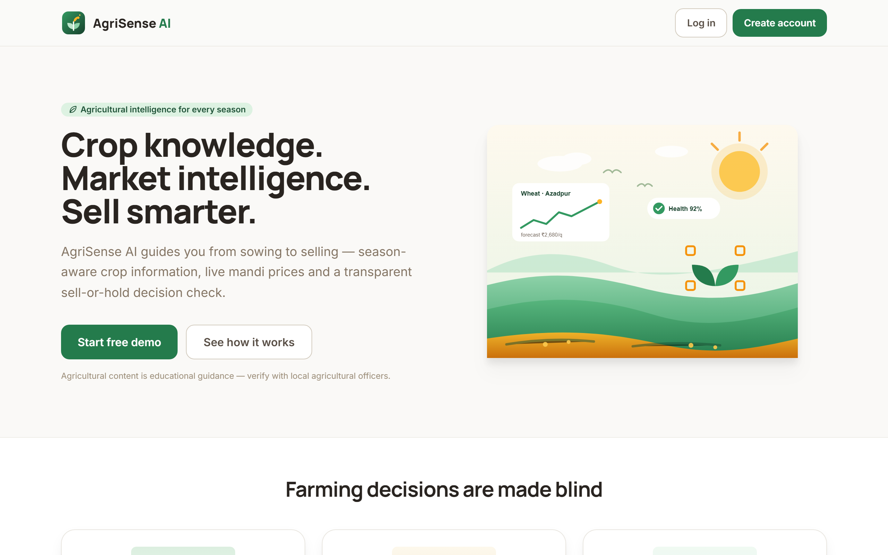

---

## 📑 Table of Contents

- [📖 About The Project](#-about-the-project)
- [🌟 Key Features](#-key-features)
- [🤖 Machine Learning Architecture](#-machine-learning-architecture)
- [🧪 Two-Stage Fertilizer Advisor & Prediction](#-two-stage-fertilizer-advisor--prediction-architecture)
- [🧠 Key Workflows](#-key-workflows)
- [📸 Interface Tour](#-interface-tour)
- [🏛️ System Architecture](#-system-architecture)
- [🛠️ Technology Stack](#-technology-stack)
- [📂 Repository Structure](#-repository-structure)
- [🚀 How to Run Locally](#-how-to-run-locally)
- [⚙️ Environment Variables](#-environment-variables)
- [📡 API Overview](#-api-overview)
- [🗄️ Database Schema & Security](#-database-schema--security)
- [🧪 Testing](#-testing)
- [⚠️ Disclaimers](#-disclaimers)

---

## 🌟 Key Features

| Capability | Description |
|---|---|
| **🤖 ML Crop Recommendation** | Tuned **Support Vector Machine (SVM)** model predicting the most suitable crop out of **22 Indian crops** based on 7 soil & environmental parameters with calibrated confidence scoring and optimal growing requirements. |
| **🧪 Two-Stage Fertilizer Advisor** | Dual partitioned workflows: **API-Based Recommendation** (stage- & soil-aware guidance) and **ML-Based Prediction** (XGBoost classifier predicting commercial formulations like Urea, DAP, 17-17-17). |
| **🌾 Three-Season Crop Catalog** | Dynamic platform-wide classification across **Rabi** (wheat, mustard, chickpea, potato, lentil, apple), **Kharif** (rice, maize, cotton, jute, pigeonpeas, blackgram, mothbeans), and **Zaid** (watermelon, cucumber, muskmelon, moong, banana, mango, etc.). |
| **📈 Mandi Price Intelligence** | Normalized mandi price board (min / max / modal per quintal), 120-day deterministic histories, and computed 7/14/30-day trends across 8 major Indian markets. |
| **⚖️ Sell or Hold Decision Engine** | Mathematical decision engine evaluating market trend trajectories against cold storage costs to recommend whether waiting or selling immediately yields higher net profit. |
| **🌦️ Live Weather & Geocoding Search** | Real-time weather via Open-Meteo (ECMWF/GFS models), interactive city search bar with autocomplete, GPS one-click location detection, and agricultural risk alerts for spraying/irrigation. |
| **🩺 Crop Health & Field Scouting** | Agronomic knowledge base cataloging symptoms, biological alternatives, and prevention protocols for all 22 crops. Includes field scouting observation logging with severity tags and photos. |
| **🛒 Farmer Marketplace** | Community trade board enabling direct farmer-to-buyer listings with produce quality grades, asking prices, unit metrics, and location search. |
| **💬 Bilingual Farmer Assistant** | Chat interface backed by an agricultural knowledge engine and LLM fallback to answer agronomic queries in plain English and Hindi. |
| **📊 Unified Dashboard** | Aggregated dashboard combining seasonal crop calendars, market price tickers, live weather cards, and field alerts with graceful degradation. |
| **🌐 Complete Bilingual Localization** | First-class, zero-dependency bilingual localization supporting both **English** and **Hindi (हिंदी)** across every screen, badge, modal, and alert. |

---

## 🤖 Machine Learning Architecture

The **Crop Recommendation Engine** helps farmers determine the optimal crop to cultivate by analyzing 7 agronomic and meteorological factors:

$$\vec{x} = \big[ N, P, K, \text{Temperature (°C)}, \text{Humidity (\%), pH, Rainfall (mm)} \big]$$

```
                        [ N, P, K, Temp, Humidity, pH, Rainfall ]
                                          │
                                          ▼
                      ┌───────────────────────────────────────┐
                      │    Tuned Support Vector Classifier    │
                      │         (RBF Kernel, C=10.0)          │
                      └───────────────────┬───────────────────┘
                                          │
                        Decision Margins: f(x) ∈ ℝ²²
                                          │
                                          ▼
                      ┌───────────────────────────────────────┐
                      │      Stable Softmax Normalization     │
                      │  P(Crop_i | x) = exp(z_i) / Σ exp(z_j)│
                      └───────────────────┬───────────────────┘
                                          │
                                          ▼
                   Top-1 Primary Crop Recommendation + Confidence Score
                   + Agricultural Ideal Range Diagnostics (N, P, K, pH)
```

### 🏆 Model Selection & Benchmark Evaluation

5 machine learning algorithms were benchmarked across standard validation data and a **50,000-sample unseen stress-test suite** (containing simulated noisy sensor inputs and severe boundary overlap):

| Model | Standard Accuracy (2,200 rows) | Unseen Stress Test (50k rows) | Noisy Sensor Accuracy | Decision Overlap Accuracy |
|---|:---:|:---:|:---:|:---:|
| **Tuned SVM (Selected)** 🥇 | **98.68%** | **89.20%** | **90.05%** | **53.52%** |
| Random Forest | 99.09% | 88.08% | 89.14% | 47.96% |
| XGBoost Classifier | 98.64% | 88.35% | 89.26% | 48.96% |
| Gaussian Naive Bayes | 99.09% | 87.87% | 89.18% | 48.33% |
| K-Nearest Neighbors | 98.18% | 85.12% | 86.20% | 44.48% |

### 🌾 Supported Crop Classes (All 22 Crops)
* **Cereals & Grains:** Rice, Maize
* **Pulses & Legumes:** Chickpea, Kidney Beans, Pigeon Peas, Moth Beans, Mung Bean, Black Gram, Lentil
* **Fruits:** Pomegranate, Banana, Mango, Grapes, Watermelon, Muskmelon, Apple, Orange, Papaya, Coconut
* **Cash Crops & Fibers:** Cotton, Jute, Coffee

### 💡 Production Engineering Highlights
- **Numerically Stable Softmax:** Computes calibrated probabilities over one-vs-rest hyperplanes using $z_i = \text{decision\_function}(\vec{x})_i$ with $z_{\max}$ offset subtraction to prevent floating-point overflow.
- **Lazy Loading Singleton:** Packaged within `backend/app/ml_models/SVM_tunned_model.pkl` and loaded on-demand to ensure fast Docker container cold-starts and low memory footprints.
- **Agronomic Requirements Mapping:** Enriches predictions with standard N-P-K nutrient targets, climate tolerances, growing seasons, and soil requirements.

---

## 🧪 Two-Stage Fertilizer Advisor & Prediction Architecture

The Fertilizer Advisor provides two clearly partitioned, user-selectable mechanisms to suit different farming workflows:

```
                                  FERTILIZER ADVISOR
                                           │
                ┌──────────────────────────┴──────────────────────────┐
                ▼                                                     ▼
    ┌───────────────────────────┐                         ┌───────────────────────────┐
    │ 🌿 API-Based Recommendation│                         │   🤖 ML-Based Prediction  │
    │         (Default)         │                         │     (XGBoost Classifier)  │
    ├───────────────────────────┤                         ├───────────────────────────┤
    │ • Crop (Rabi/Kharif/Zaid) │                         │ • Crop (Filtered by season│
    │ • Growth Stage            │                         │ • Season (Kharif/Rabi/Zaid│
    │ • Soil Condition          │                         │ • Soil Type (5 classes)   │
    │ • Soil Test Notes (NPK)   │                         │ • N, P, K Nutrient Levels │
    │                           │                         │ • Temp, Humidity, Moisture│
    ├───────────────────────────┤                         ├───────────────────────────┤
    │          Output:          │                         │          Output:          │
    │ Agronomic Guidance &      │                         │ Predicted Formulation     │
    │ Application Timing        │                         │ (Urea, DAP, 17-17-17, etc)│
    │ (Rule / Knowledge-based)  │                         │ + Calibrated Confidence % │
    └───────────────────────────┘                         └───────────────────────────┘
```

1. **API-Based Recommendation (Knowledge / Rule-Driven):**
   - **Methodology:** Domain-driven agronomic knowledge mapping growth stages (sowing, vegetative, flowering, grain filling) and soil conditions to category recommendations and split-application timing.
   - **Endpoint:** `POST /api/v1/fertilizer-guidance`

2. **ML-Based Fertilizer Prediction (Data-Driven XGBoost):**
   - **Methodology:** Multi-class extreme gradient boosting classifier (`XGBClassifier`, 300 estimators, max depth 5, learning rate 0.2) trained on 39 one-hot encoded and numerical features.
   - **Target Formulations:** `Urea` (46-0-0), `DAP` (18-46-0), `17-17-17`, `10-26-26`, `14-35-14`, `20-20` (+13% S), `28-28`.
   - **Endpoint:** `POST /api/v1/fertilizer/ml-predict`

---

## 🧠 Key Workflows

```mermaid
flowchart TD
    subgraph S1["1. Seasonal Context Switching"]
        Switch["Farmer selects Season: Rabi / Kharif / Zaid"]
        Context["CropContext broadcast via React Context & LocalStorage"]
        Views["Dashboard, Health, Fertilizer, and Market dynamically adapt"]
        Switch --> Context --> Views
    end

    subgraph S2["2. ML Crop Recommendation"]
        InputCrop["Soil Nutrients (N, P, K, pH) + Climate (Temp, Humidity, Rain)"]
        SVM["Tuned SVM (RBF Kernel, C=10.0) with Decision-Margin Softmax"]
        OutputCrop["Top-1 Crop Recommendation + Confidence + Agronomic Diagnostics"]
        InputCrop --> SVM --> OutputCrop
    end

    subgraph S3["3. Partitioned Fertilizer Advisor"]
        direction TB
        Choice{"Select Advisory Mode"}
        Choice -->|API-Based| RuleEngine["Rule Knowledge Base: Growth Stage + Soil Condition"]
        Choice -->|ML-Based| XGB["XGBoost 39-Feature Classifier (xgb_tunned_model.pkl)"]
        RuleEngine --> RuleOut["Targeted Guidance, NPK Timing & Split Schedule"]
        XGB --> MLOut["Commercial Formulation (Urea, DAP, 17-17-17, etc.) + Confidence %"]
    end

    subgraph S4["4. Sell or Hold Decision Support"]
        MandiData["120-Day Mandi Price Series + 7/14/30-Day Trend Calculation"]
        Storage["Storage Cost Simulation: Days × Cost/Quintal × Quantity"]
        Verdict["Decision Output: Expected Return, Risk Level & Actionable Rationale"]
        MandiData & Storage --> Verdict
    end

    subgraph S5["5. Crop Health & Field Scouting"]
        Scout["Farmer logs in-field observation: Disease, Severity & Photo"]
        KB["22-Crop Agronomic Catalog: Symptoms, Bio-Treatments & Prevention"]
        Records["Encrypted Observation History + Direct Image Serving"]
        Scout & KB --> Records
    end
```

### Detailed Workflow Walkthroughs:

#### 🌾 1. Global Season & Crop Adaptive Navigation
- The farmer selects **Rabi**, **Kharif**, or **Zaid** from the responsive header or sidebar switcher.
- State is preserved in `CropContext` and cached locally.
- Crop catalogs across the **Dashboard**, **My Crops**, **Crop Health**, and **Fertilizer Advisor** reactively synchronize with the chosen season.

#### 🤖 2. Machine Learning Crop Suitability Recommendation
- Farmer provides 7 soil and climatic factors ($N, P, K$, Temperature, Humidity, pH, Rainfall).
- The FastAPI backend validates input ranges and invokes `MLCropRecommender`.
- Evaluates the inputs against the tuned **Support Vector Classifier (RBF kernel, $C=10.0$)**, computing decision-function margins normalized via numerically stable softmax.
- Returns the primary recommended crop, calibrated confidence percentage, top 3 viable alternative crops, and optimal range comparison diagnostics.

#### 🧪 3. Two-Stage Partitioned Fertilizer Advisory
- **Mode 1 — API-Based Recommendation (Default):**
  - Farmer chooses crop, vegetative growth stage (`Sowing`, `Vegetative`, `Flowering`, `Grain Filling`), and soil condition.
  - Returns verified agricultural advisory detailing the recommended fertilizer category, timing, and split applications.
- **Mode 2 — ML-Based Fertilizer Prediction:**
  - Farmer selects Season (which dynamically filters the Crop dropdown), Soil Type (`Black`, `Clayey`, `Loamy`, `Red`, `Sandy`), NPK levels, Temperature, Humidity, and Moisture.
  - The backend pipeline one-hot encodes categorical dimensions into the exact 39-feature matrix expected by `xgb_tunned_model.pkl`.
  - Returns the predicted commercial formulation (`Urea`, `DAP`, `17-17-17`, `10-26-26`, `14-35-14`, `20-20`, `28-28`), confidence score, input parameter summary pill tag, agronomic purpose, and class probability distribution.

#### 📈 4. Mandi Price Tracking & Sell-or-Hold Decision Engine
- Normalizes daily modal, minimum, and maximum prices per quintal across 8 major APMC mandis for all crops.
- Computes 7-day, 14-day, and 30-day directional trends and price velocity.
- The **Sell vs. Hold Engine** allows farmers to input harvest quantity, planned storage duration, and monthly warehouse costs to determine whether price appreciation will exceed carrying costs.

#### 🩺 5. Crop Health Diagnostics & Field Scouting Records
- Browse educational symptoms, chemical management, organic alternatives, and prevention protocols for all 22 crops.
- Farmers can log field scouting observations with photo evidence (verified via client-side preview and server-side magic-byte sniffing) and track infestation severity over time.

---

## 📸 Interface Tour

| Sign In | Create Account |
| :---: | :---: |
| 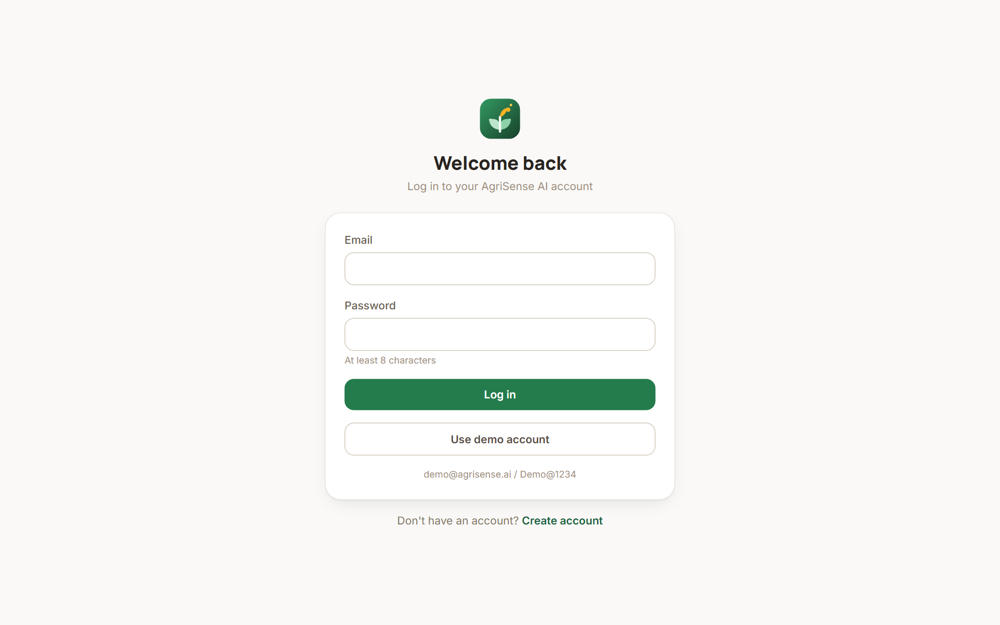 | 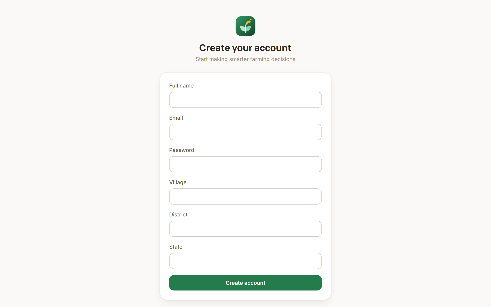 |

| Farmer Dashboard | Crop Recommendation (ML) |
| :---: | :---: |
| 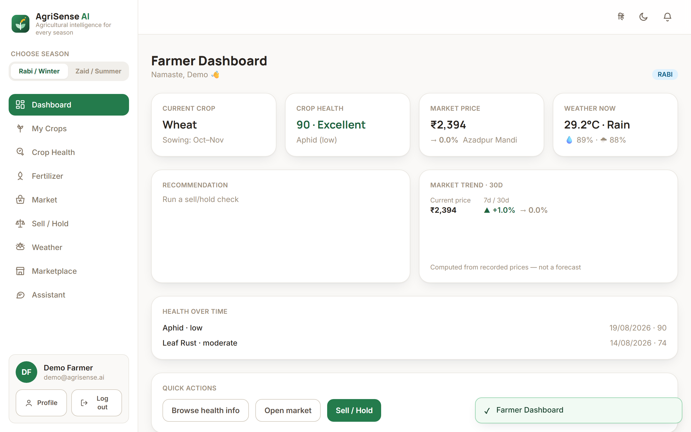 | 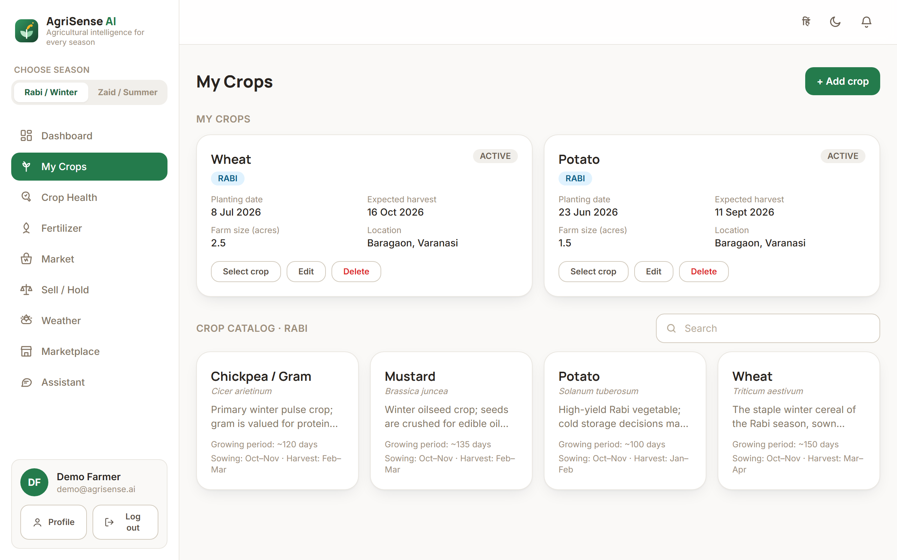 |

| Market Price Intelligence | Live Weather & City Search |
| :---: | :---: |
| 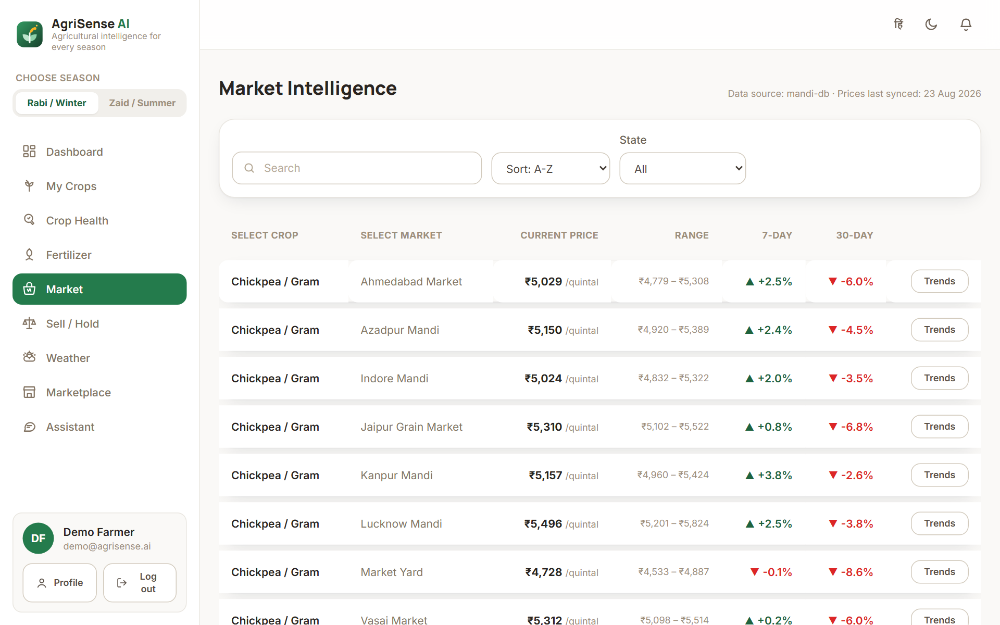 | 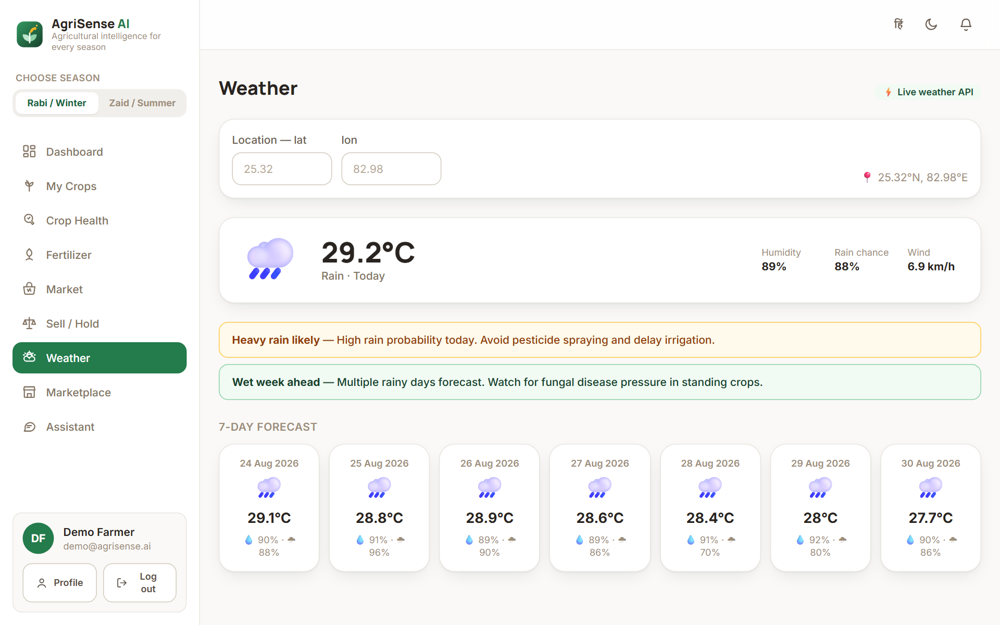 |

| Crop Health & Disease Catalog | Sell vs. Hold Recommendation Engine |
| :---: | :---: |
| 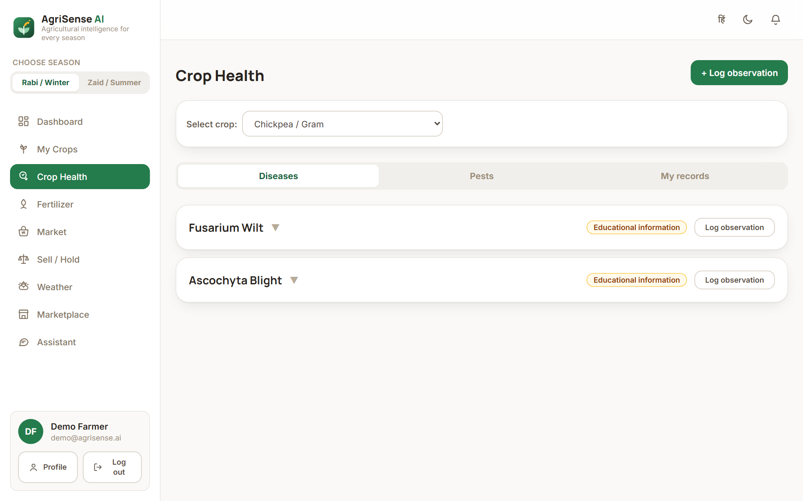 | 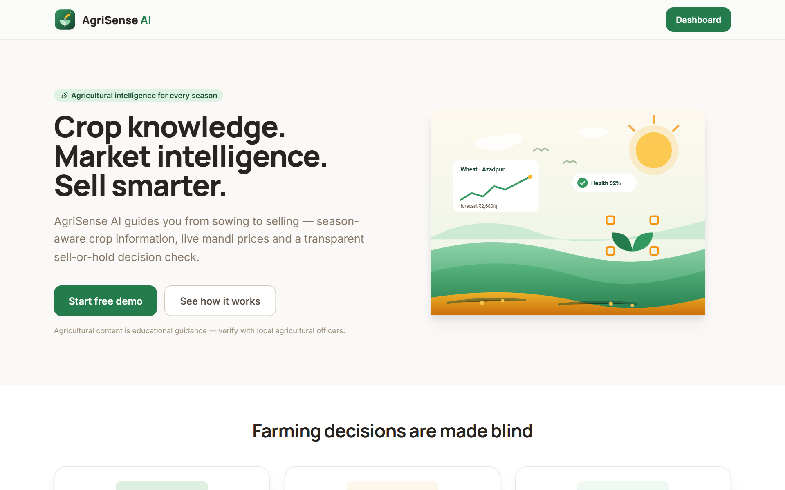 |

| Farmer Marketplace | Farmer Assistant |
| :---: | :---: |
| 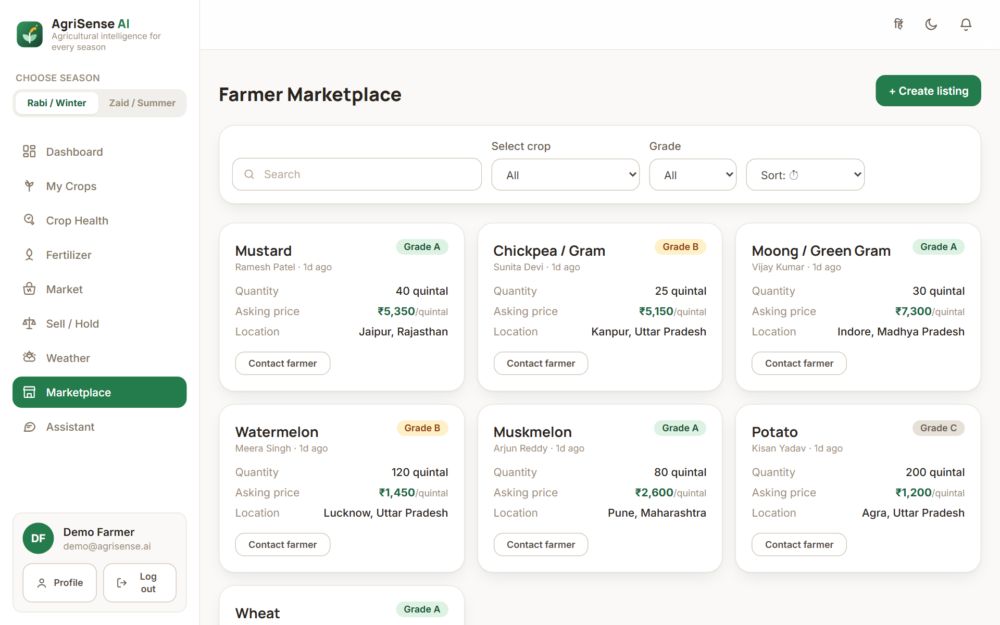 | 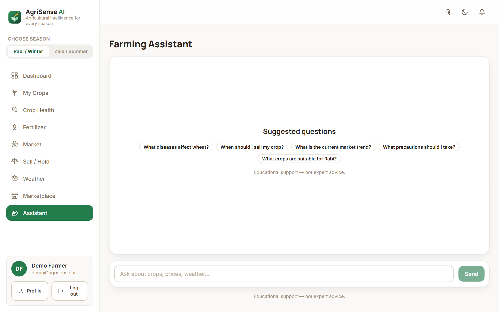 |

---

## 🏛️ System Architecture

The frontend communicates with the backend's versioned REST API (`/api/v1`, JSON over HTTP with JWT bearer authentication). The backend acts as the single source of truth, validating all inputs, managing database transactions, caching responses, and orchestrating ML models and external APIs.

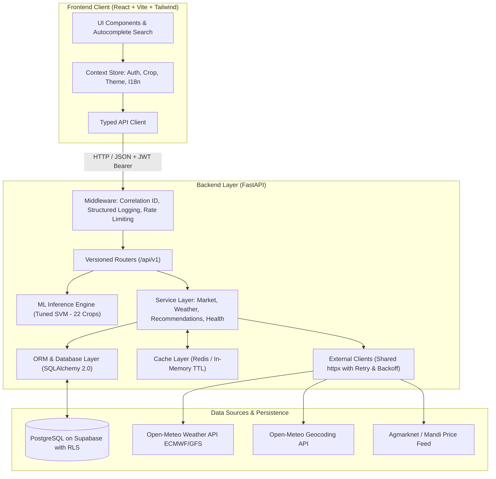

---

## 🛠️ Technology Stack

| Layer | Technologies |
|---|---|
| **Frontend** | React 18, TypeScript 5.5, Vite 5.4, Tailwind CSS 3.4, React Router 6, Recharts, Marked, DOMPurify |
| **Backend** | Python 3.11, FastAPI, Pydantic v2, SQLAlchemy 2.0, Uvicorn, httpx (async HTTP client) |
| **Machine Learning** | Scikit-Learn (SVM RBF), XGBoost (XGBClassifier), NumPy, Pandas, Joblib |
| **Database** | PostgreSQL 16 on Supabase (with Row Level Security) / SQLite fallback |
| **Caching** | Redis 7 / In-memory process-local TTL cache fallback |
| **Security & Auth** | JWT (HS256) with Passlib & Bcrypt, Supabase RLS, rate limiting, magic-byte upload validation |
| **Localization** | Lightweight custom I18n provider supporting English and Hindi (हिंदी) |
| **Deployment** | Vercel (Frontend), Render (Backend), Supabase (Database), Docker Compose |

---

## 📂 Repository Structure

```text
AgriSense-AI/
|-- frontend/
|   |-- src/
|   |   |-- api/               auth provider
|   |   |-- assets/            logos, crop illustrations
|   |   |-- components/        layout, UI primitives, modal, shared states
|   |   |-- config/            API base URL, backend origin
|   |   |-- hooks/             data fetching, debounce, online status
|   |   |-- i18n/              English + Hindi dictionaries
|   |   |-- pages/             application pages (Crop Recommendation, Fertilizer, Health, etc.)
|   |   |-- services/          typed API service modules (single fetch client)
|   |   |-- store/             crop selection (Rabi/Kharif/Zaid), notifications, theme contexts
|   |   |-- types/             API contract types mirroring backend schemas
|   |   `-- utils/             formatting, image resolution, markdown
|-- backend/
|   |-- app/
|   |   |-- api/v1/            REST routers (versioned: crops, fertilizer, weather, etc.)
|   |   |-- core/              config, security, cache, errors
|   |   |-- db/                engine, session, idempotent seeding (25 crops, 8 mandis)
|   |   |-- external/          weather, mandi and assistant clients
|   |   |-- middleware/        request context, rate limiting
|   |   |-- ml_models/         trained model binaries (SVM_tunned_model.pkl, xgb_tunned_model.pkl)
|   |   |-- models/            SQLAlchemy ORM models
|   |   |-- schemas/           Pydantic request/response schemas (ml_fertilizer, crop_rec, etc.)
|   |   `-- services/          ML crop service, ML fertilizer service, weather, market, knowledge
|   |-- tests/                 94 automated pytest test cases (100% pass)
|   |-- Dockerfile             production container configuration
|   `-- requirements.txt       backend dependencies (including scikit-learn & xgboost)
|-- datasets/
|   |-- crop recommendation/   evaluation notebooks and datasets (2.2k and 50k stress-test)
|   `-- Fertilizer prediction/ training notebooks, datasets, and serialized XGBoost model
|-- render.yaml                Render deployment blueprint
|-- docker-compose.yml         postgres + redis + backend + frontend
|-- .env.example               environment variable template
`-- README.md
```

---

## 🚀 How to Run Locally

### Option 1: Docker Compose (Recommended)

Starts PostgreSQL, Redis, the FastAPI backend, and the React frontend:

```bash
docker compose up --build
```

| Service | URL |
|---|---|
| **Frontend** | [http://localhost:5173](http://localhost:5173) |
| **Backend API** | [http://localhost:8000/api/v1](http://localhost:8000/api/v1) |
| **Swagger UI** | [http://localhost:8000/docs](http://localhost:8000/docs) |
| **Health Check** | [http://localhost:8000/health](http://localhost:8000/health) |

---

### Option 2: Local Development (Zero Infrastructure)

The backend defaults to a local SQLite database and automatically seeds initial reference data on startup.

**1. Backend:**
```bash
cd backend
python -m venv .venv
# On Windows:
.venv\Scripts\activate
# On macOS/Linux:
# source .venv/bin/activate

pip install -r requirements.txt
uvicorn app.main:app --reload --port 8000
```

**2. Frontend:**
```bash
cd frontend
npm install
npm run dev        # http://localhost:5173
```

---

## ⚙️ Environment Variables

Copy `.env.example` to `.env` (backend reads `backend/.env`). Every external integration is optional; when unconfigured, database fallbacks apply.

| Variable | Purpose | Default |
|---|---|---|
| `DATABASE_URL` | PostgreSQL connection string; SQLite when unset | SQLite file |
| `JWT_SECRET` | JWT signing secret | development value, must be changed in production |
| `ACCESS_TOKEN_EXPIRE_DAYS` | Access token lifetime | `7` |
| `CORS_ORIGINS` | Comma-separated allowed browser origins | `http://localhost:5173,...` |
| `UPLOAD_DIR` / `MAX_UPLOAD_MB` | Crop image upload storage and size cap | `uploads` / `8` |
| `WEATHER_API_URL` | Open-Meteo-compatible weather endpoint | `https://api.open-meteo.com/v1` |
| `REDIS_URL` | Shared cache backend; empty uses process-local TTL cache | empty |
| `VITE_API_BASE_URL` | API base URL used by the frontend | `http://localhost:8000/api/v1` |

---

## 📡 API Overview

All endpoints are versioned under `/api/v1`. Interactive OpenAPI documentation is served at `/docs`.

| Area | Endpoints |
|---|---|
| **Crop Recommendation (ML)** | `POST /api/v1/crop-recommendation/predict` (22 crops, SVM RBF model), `GET /crop-recommendation/model-info`, `GET /crop-recommendation/presets` |
| **Fertilizer Advisor (Dual Mode)** | • Rule Guidance: `POST /fertilizer-guidance`<br>• ML Prediction: `POST /fertilizer/ml-predict` (XGBoost 39-feature model)<br>• ML Metadata & Presets: `GET /fertilizer/ml-info`, `GET /fertilizer/ml-presets` |
| **System & Health** | `GET /api/v1/system`; `GET /health`, `GET /health/live`, `GET /health/ready` |
| **Authentication** | `POST /auth/register`, `POST /auth/login`, `POST /auth/logout`, `GET /auth/me`, `PATCH /auth/me` |
| **Seasons & Crops** | `GET /seasons`, `GET /seasons/{season}/crops`, `GET/POST /crops`, `GET/PATCH/DELETE /crops/{id}`, `GET/POST/DELETE /crops/{crop_id}/records` |
| **Knowledge Base** | `GET /diseases`, `GET /pests`, `GET /treatments`, `GET /fertilizers` (22 crops covered) |
| **Market Intelligence** | `GET /market/markets`, `GET /market/prices`, `GET /market/trends/{cropId}` (120-day historical series) |
| **Weather** | `GET /weather/current`, `GET /weather/forecast`, `GET /weather/location` |
| **Decisions** | `POST /recommendations/sell-hold`, `GET /recommendations/history` |
| **Dashboard** | `GET /dashboard` (single aggregated response) |
| **Marketplace** | `GET/POST /listings`, `GET/PATCH/DELETE /listings/{id}` |
| **Assistant** | `POST /assistant/chat`, `GET /assistant/conversations[/{id}]` |
| **Notifications** | `GET /notifications`, `PATCH /notifications/{id}/read`, `PATCH /notifications/read-all` |
| **Uploads** | `POST /uploads` (multipart, images only, magic-byte sniffed) |

---

## 🗄️ Database Schema & Security

All 13 public tables are protected with **Supabase Row Level Security (RLS)**, ensuring zero unauthorized direct public access via client keys, while the backend maintains full transactional access via PostgreSQL superuser connections.

| Entity | Purpose | Security & Ownership |
|---|---|---|
| `users` | User accounts with bcrypt-hashed credentials | Protected with RLS |
| `farmer_profiles` | Village, district, state, farm size in acres | One-to-one with `users` |
| `crops` | Catalog: season (Rabi, Kharif, Zaid), growing period, sowing and harvest windows | Reference catalog (25 crops) |
| `farmer_crops` | User-planted crops and harvest dates | Scoped to authenticated user |
| `health_records` | Field observations: disease/pest, severity, photo URL | User-owned with delete support |
| `markets` & `market_prices` | Mandi reference data and 120-day price records across 8 mandis | Reference data |
| `sell_hold_recommendations` | Decision outputs with storage cost and expected return | Scoped to user and crop |
| `crop_listings` | Marketplace trade listings with contact info | User-owned trade listings |
| `assistant_conversations` & `messages`| Farmer assistant conversational history | Scoped to authenticated user |
| `notifications` | In-app alerts for weather, market, and field records | User-scoped notification feed |

---

## 🧪 Testing

```bash
# Run backend pytest suite (94 tests, 100% pass)
cd backend
pytest tests/ -v

# Run frontend TypeScript check & production build
cd frontend
npm run build
```

---

## ⚠️ Disclaimers

- **Educational Guidance**: Agricultural content (diseases, pests, treatments, fertilizer guidance) is educational information. Always consult local Krishi Vigyan Kendras (KVK) or certified agricultural extension officers before taking action.
- **Decision Support**: The sell or hold engine provides mathematical decision-support rules based on recorded mandi trends and storage costs. It does not constitute financial advice.
