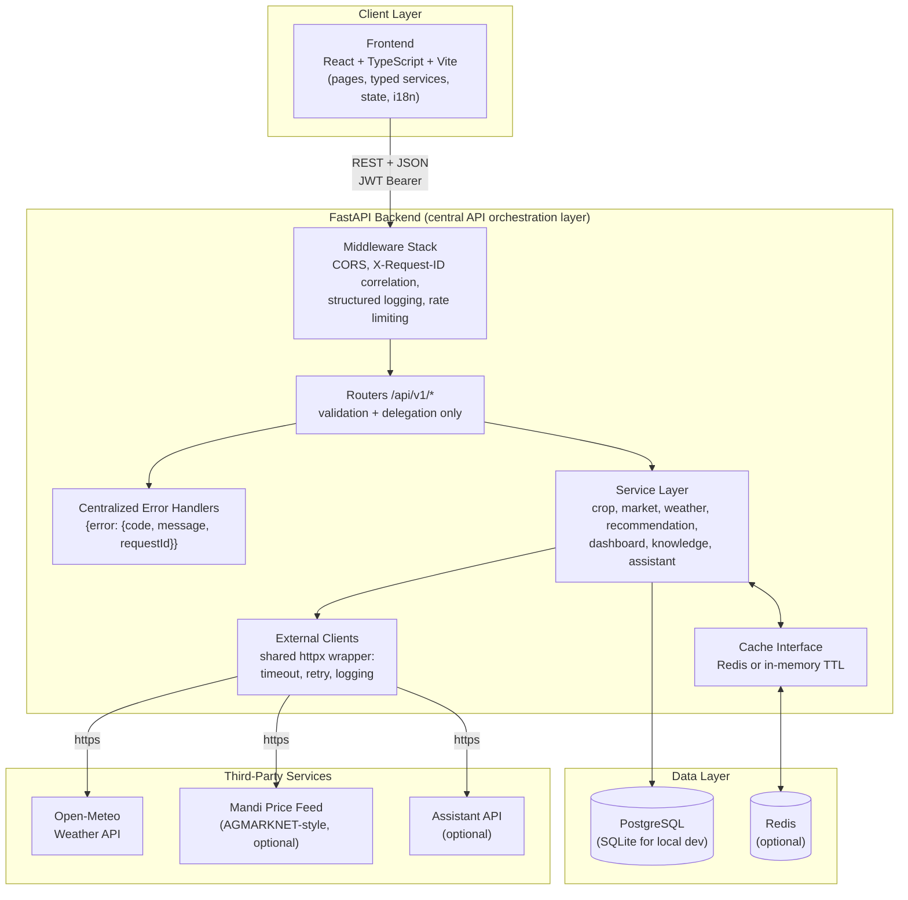
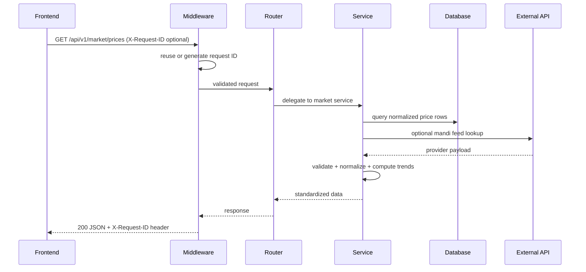
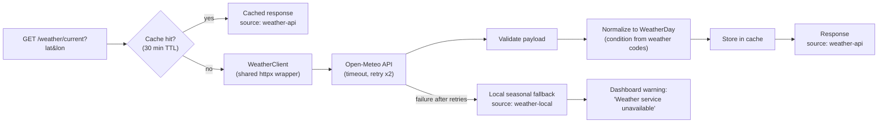
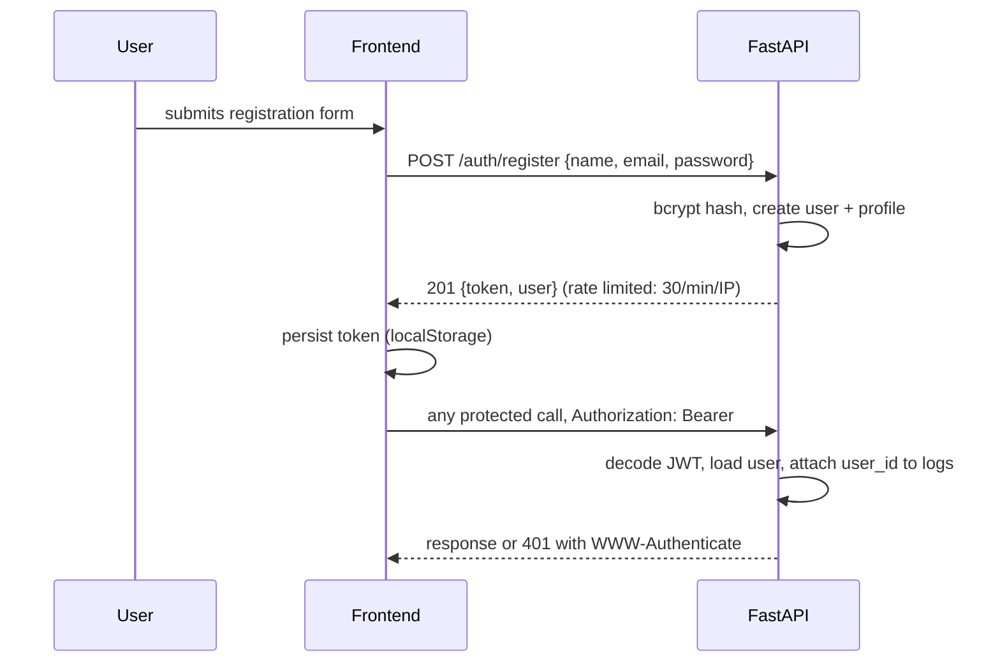
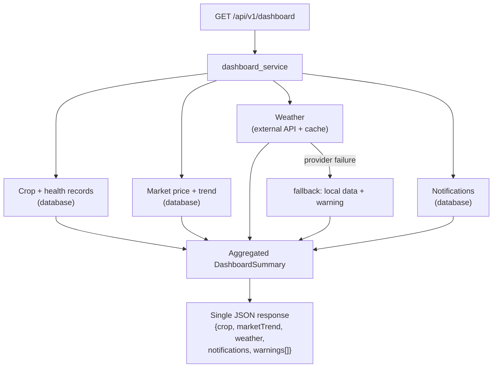
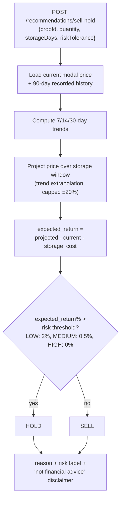
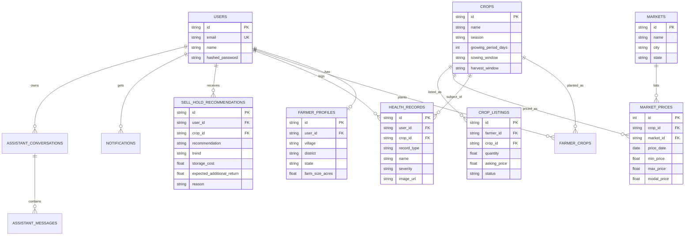

# AgriSense AI

A REST API-driven agricultural information and decision-support platform for Indian farmers. AgriSense AI delivers season-aware crop knowledge, normalized mandi (market) price intelligence, weather forecasts and transparent sell-or-hold decision support through a well-structured backend that acts as the central API orchestration layer.

The backend owns the database, integrates external APIs (weather, mandi prices, optional assistant), normalizes their responses and serves a single standardized REST contract to the frontend. The frontend never calls third-party services directly.

> **Architecture note.** This project was migrated from an earlier ML-oriented architecture to a pure REST API / API-integration architecture. There is no machine-learning dependency in the running application. The preserved provider design for a possible future ML phase is documented in [docs/future-ml.md](docs/future-ml.md).

---

## Table of Contents

1. [What the Platform Does](#what-the-platform-does)
2. [System Architecture](#system-architecture)
3. [Technology Stack](#technology-stack)
4. [Repository Structure](#repository-structure)
5. [How to Run](#how-to-run)
6. [Environment Variables](#environment-variables)
7. [API Overview](#api-overview)
8. [Key Workflows](#key-workflows)
9. [Database Schema](#database-schema)
10. [External Integrations](#external-integrations)
11. [Cross-Cutting Concerns](#cross-cutting-concerns)
12. [Testing](#testing)
13. [Disclaimers](#disclaimers)

---

## What the Platform Does

AgriSense AI supports a farmer across the full season cycle:

| Capability | Description |
|---|---|
| Season and crop catalog | Rabi (wheat, chickpea, mustard, potato) and Zaid/summer (watermelon, cucumber, muskmelon, moong) crops with growing calendars, all database-driven |
| Crop management | Farmers register plantings (CRUD) with area, dates, location and status |
| Disease and pest knowledge | Structured, educational information per crop: symptoms, recommended actions, management guidance, organic alternatives and prevention |
| Treatment information | Educational treatment entries linked to each disease and pest, with no chemical dosage claims |
| Fertilizer guidance | Rule-based, stage- and soil-aware nutrient category recommendations |
| Health records | Farmers log field observations (disease or pest, severity, optional photo) and track them over time |
| Market intelligence | Normalized mandi price board (min / max / modal per quintal), 90-day history and rule-computed 7/14/30-day trends across 8 markets |
| Weather | Live forecast through the backend-owned weather integration, with agricultural alerts; falls back to local seasonal data when the provider is unavailable |
| Sell or hold support | A transparent rule engine that compares recorded market trends against storage costs and returns a clearly reasoned recommendation |
| Marketplace | Listings with search, filtering, sorting, pagination and ownership control |
| Farmer assistant | A chat interface backed by a rule-based engine, optionally forwarded to an external conversational API |
| Dashboard | One aggregated request combining crop, health, market, weather and notification data |
| Notifications | Event feed for analyses, market moves, recommendations and weather watches |

Everything the user sees is served by the backend's versioned REST API. Agricultural content is explicitly labelled as educational information.

---

## System Architecture



Layer responsibilities:

| Layer | Directory | Responsibility |
|---|---|---|
| Middleware | `backend/app/middleware/` | Request correlation IDs, structured request logging, fixed-window rate limiting |
| Routers | `backend/app/api/v1/` | HTTP contracts, Pydantic validation, auth dependencies, status codes. No business logic |
| Services | `backend/app/services/` | All business logic: market normalization, weather integration with fallback, rule engine, dashboard aggregation, knowledge services |
| External clients | `backend/app/external/` | Outbound HTTP through one shared client (timeout, retry with backoff, latency logging, payload validation and normalization) |
| Models | `backend/app/models/` | SQLAlchemy ORM entities |
| Schemas | `backend/app/schemas/` | Pydantic models; snake_case internally, camelCase on the wire |
| Core | `backend/app/core/` | Settings, JWT/bcrypt security, cache backends, error types |

---

## Technology Stack

| Layer | Choice |
|---|---|
| Frontend | React 18, TypeScript, Vite, Tailwind CSS, React Router |
| Backend | Python 3.11, FastAPI |
| Database | PostgreSQL 16 (SQLite for zero-setup local development) |
| Cache | Redis 7 (process-local TTL cache as fallback) |
| Authentication | JWT (HS256) with bcrypt password hashing |
| HTTP client | httpx (async, shared wrapper with retry and logging) |
| API documentation | OpenAPI 3 / Swagger UI at `/docs`, ReDoc at `/redoc` |
| Testing | pytest (backend), TypeScript compiler and Vite build (frontend) |
| Containerization | Docker, Docker Compose |

---

## Repository Structure

```text
AgriSense-AI/
|-- frontend/
|   |-- src/
|   |   |-- api/               auth provider
|   |   |-- assets/            logos, crop illustrations
|   |   |-- components/        layout, UI primitives, shared states and badges
|   |   |-- config/            API base URL, feature flags
|   |   |-- hooks/             data fetching, debounce, online status
|   |   |-- i18n/              English + Hindi dictionaries
|   |   |-- pages/             13 application pages
|   |   |-- services/          typed API service modules (single fetch client)
|   |   |-- store/             crop selection, notifications, theme contexts
|   |   |-- types/             API contract types mirroring the backend
|   |   `-- utils/             formatting, safe markdown rendering
|-- backend/
|   |-- app/
|   |   |-- api/v1/            REST routers (versioned)
|   |   |-- core/              config, security, cache, errors
|   |   |-- db/                engine, session, idempotent seeding
|   |   |-- external/          weather, mandi and assistant clients
|   |   |-- middleware/        request context, rate limiting
|   |   |-- models/            SQLAlchemy ORM models
|   |   |-- schemas/           Pydantic request/response schemas
|   |   `-- services/          business logic
|   |-- future/ml/             preserved ML provider design (not in runtime)
|   `-- tests/                 pytest suite, external APIs always mocked
|-- docs/
|   |-- api.md                 endpoint reference
|   |-- api-pipeline.md        six documented end-to-end pipelines
|   |-- architecture.md        architecture deep-dive
|   |-- external-apis.md       integration and normalization details
|   `-- future-ml.md           future ML extension plan
|-- docker-compose.yml         postgres + redis + backend + frontend
|-- .env.example               environment variable template
`-- README.md
```

---

## How to Run

### Option 1: Docker Compose (recommended)

Starts PostgreSQL, Redis, the FastAPI backend and the React frontend:

```bash
docker compose up --build
```

| Service | URL |
|---|---|
| Frontend | http://localhost:5173 |
| Backend API | http://localhost:8000/api/v1 |
| Swagger UI | http://localhost:8000/docs |
| Health checks | http://localhost:8000/health, `/health/live`, `/health/ready` |

A demo account is seeded automatically on first start:

```
email:    demo@agrisense.ai
password: Demo@1234
```

### Option 2: Local development (zero infrastructure)

The backend defaults to a local SQLite file and seeds reference data (8 crops, 8 mandis, 120 days of deterministic prices, demo user, sample records and listings) on startup.

Backend:

```bash
cd backend
python -m venv .venv
.venv/Scripts/pip install -r requirements.txt          # Windows
# source .venv/bin/activate && pip install -r requirements.txt   # macOS/Linux
.venv/Scripts/uvicorn app.main:app --reload --port 8000
```

Frontend:

```bash
cd frontend
npm install
npm run dev        # http://localhost:5173
```

To use PostgreSQL locally instead, set `DATABASE_URL` in `backend/.env` (see `.env.example`).

### Running tests

Backend (external APIs are always mocked; no third-party calls):

```bash
cd backend
.venv/Scripts/python -m pytest tests/ -q
```

Frontend type check and production build:

```bash
cd frontend
node node_modules/typescript/bin/tsc --noEmit
node node_modules/vite/bin/vite.js build
```

---

## Environment Variables

Copy `.env.example` to `.env` (backend reads `backend/.env`). Every external integration is optional; when unconfigured, database fallbacks apply and each response discloses its `source`.

| Variable | Purpose | Default |
|---|---|---|
| `DATABASE_URL` | PostgreSQL connection string; SQLite when unset | SQLite file |
| `JWT_SECRET` | JWT signing secret | development value, must be changed in production |
| `ACCESS_TOKEN_EXPIRE_DAYS` | Access token lifetime | `7` |
| `CORS_ORIGINS` | Comma-separated allowed browser origins | `http://localhost:5173,...` |
| `UPLOAD_DIR` / `MAX_UPLOAD_MB` | Crop image upload storage and size cap | `uploads` / `8` |
| `WEATHER_API_URL` / `WEATHER_API_KEY` | Open-Meteo-compatible weather endpoint | open-meteo.com (no key required) |
| `MANDI_API_URL` / `MANDI_API_KEY` | AGMARKNET-style price feed; empty serves database data (`mandi-db`) | empty |
| `ASSISTANT_API_URL` / `ASSISTANT_API_KEY` | External conversational API; empty uses the rule-based assistant | empty |
| `REDIS_URL` | Shared cache backend; empty uses a process-local TTL cache | empty |
| `RATE_LIMIT_AUTH` / `RATE_LIMIT_ASSISTANT` / `RATE_LIMIT_UPLOADS` | Fixed-window limits, requests per minute per IP | `30` / `20` / `30` |
| `VITE_API_BASE_URL` | API base URL used by the frontend | `http://localhost:8000/api/v1` |

---

## API Overview

All endpoints are versioned under `/api/v1`. The full reference with request and response shapes is in [docs/api.md](docs/api.md); the interactive OpenAPI documentation is served at `/docs`.

| Area | Endpoints |
|---|---|
| System and health | `GET /api/v1/system`; `GET /health`, `GET /health/live`, `GET /health/ready` (root level) |
| Authentication | `POST /auth/register`, `POST /auth/login`, `POST /auth/logout`, `GET /auth/me`, `PATCH /auth/me` |
| Seasons | `GET /seasons`, `GET /seasons/{id}`, `GET /seasons/{id}/crops` |
| Crops | `GET/POST /crops`, `GET/PATCH/DELETE /crops/{id}`, crop-scoped `diseases`, `pests`, `treatments`, `fertilizers`, `records` |
| Diseases | `GET /diseases`, `GET /diseases/{id}`, `GET /diseases/{id}/treatments` |
| Pests | `GET /pests`, `GET /pests/{id}`, `GET /pests/{id}/treatments` |
| Treatments | `GET /treatments`, `GET /treatments/{id}` |
| Fertilizers | `GET /fertilizers`, `GET /fertilizers/{id}`, `POST /fertilizer-guidance` |
| Market | `GET /market/markets`, `GET /market/prices`, `GET /market/prices/{cropId}`, `GET /market/trends/{cropId}` |
| Weather | `GET /weather/current`, `GET /weather/forecast`, `GET /weather/location` |
| Decisions | `POST /recommendations/sell-hold`, `GET /recommendations/history` |
| Dashboard | `GET /dashboard` (single aggregated response) |
| Marketplace | `GET/POST /listings`, `GET/PATCH/DELETE /listings/{id}` |
| Assistant | `POST /assistant/chat`, `GET /assistant/conversations[/{id}]` |
| Notifications | `GET /notifications`, `PATCH /notifications/{id}/read`, `PATCH /notifications/read-all` |
| Uploads | `POST /uploads` (multipart, images only, magic-byte sniffed) |

---

## Key Workflows

### Request lifecycle with correlation

Every request carries an `X-Request-ID` end to end. If the client provides one it is echoed back; otherwise a new identifier is generated. The identifier appears in every log line and in every error envelope.



### External API pipeline (weather)



### Authentication flow



### Dashboard aggregation with graceful degradation



### Sell or hold decision engine (transparent rules, no ML)



Additional pipelines (database read, cached external flow, error flow) are documented in [docs/api-pipeline.md](docs/api-pipeline.md).

---

## Database Schema



Seeding (`backend/app/db/seed.py`) is idempotent and date-deterministic: reference crops and markets, 120 days of price history per crop and market pair, a demo account with plantings and records, and sample marketplace listings.

---

## External Integrations

All outbound traffic flows through the shared `ExternalHttpClient` (8-second timeout, two retries with backoff, structured latency logging). Payload validation and normalization happen once, inside the clients, so services and the frontend only ever see stable internal shapes.

| Integration | Client | Configuration | Fallback |
|---|---|---|---|
| Weather | `weather_client.py` | `WEATHER_API_URL`, `WEATHER_API_KEY` | Deterministic local seasonal data, response labelled `weather-local` |
| Mandi prices | `mandi_client.py` | `MANDI_API_URL`, `MANDI_API_KEY` | Seeded database prices, response labelled `mandi-db` |
| Assistant | `assistant_client.py` | `ASSISTANT_API_URL`, `ASSISTANT_API_KEY` | Built-in rule-based assistant, response labelled `RULE_BASED` |

Every price object on the wire carries `minPrice`, `maxPrice`, `modalPrice`, `unit` and `source`, regardless of whether the data originated from the external feed or the database. Details, including the third-party field-name variants the normalizer accepts, are in [docs/external-apis.md](docs/external-apis.md).

---

## Cross-Cutting Concerns

**Error handling.** Application errors translate into a single envelope: `{"error": {"code", "message", "requestId"}}`. Codes include `VALIDATION_ERROR` (422), `RATE_LIMITED` (429), `NOT_FOUND` (404), `EXTERNAL_SERVICE_UNAVAILABLE` (503), `EXTERNAL_SERVICE_TIMEOUT` (504), `EXTERNAL_SERVICE_BAD_RESPONSE` (502) and `INTERNAL_ERROR` (500). Stack traces never reach clients.

**Logging.** Structured request logs include the request ID, HTTP method, path, status code, duration in milliseconds and, where available, the authenticated user ID. Credentials, tokens and API keys are never logged.

**Caching.** One cache interface with two backends: Redis when `REDIS_URL` is configured and the optional package is installed, otherwise a process-local TTL store. Weather responses are cached for 30 minutes and market metadata for one hour; cache keys always include the query parameters.

**Rate limiting.** Fixed-window per-IP limits on sensitive boundaries: `/api/v1/auth` (30/min), `/api/v1/assistant` (20/min) and `/api/v1/uploads` (30/min). Exceeding a limit returns a `RATE_LIMITED` envelope with a `Retry-After` header.

**Security.** bcrypt password hashing; JWT bearer authentication; ownership checks on all farmer-owned resources (foreign identifiers return 404); upload validation by magic-byte MIME sniffing with extension and size caps and generated UUID filenames; weather coordinates validated against India bounds; CORS restricted to configured origins; secrets supplied only through environment variables.

**Offline awareness.** The frontend caches successful GET responses in `localStorage`; when the network is unavailable it renders the last synchronized data with an explicit stale banner. Live market and weather data is never claimed to be available offline.

---

## Testing

The backend suite covers authentication, crop CRUD and isolation, seasons, disease/pest/treatment/fertilizer information services, normalized market data and trends, rule-engine decisions (including internal math consistency), dashboard aggregation, weather with a mocked provider, external-API failure and normalization edge cases, request correlation, rate limiting and OpenAPI completeness. Automated tests never call real third-party services; clients expose reset seams for mock injection.

Raw ML datasets used by the earlier architecture are excluded from version control (see `.gitignore`); the future-extension plan in [docs/future-ml.md](docs/future-ml.md) documents how they would be reintroduced alongside trained models.

---

## Disclaimers

- Agricultural content (diseases, pests, treatments, fertilizer guidance) is educational information, labelled as such in both the API and the UI. Always consult local agricultural officers before acting on it.
- The sell or hold engine is a transparent decision-support rule based on recorded mandi trends. It is not financial advice.

## Future ML Extension

The service layer is structured so a trained-model provider could be added later without changing the REST contract. The preserved provider design lives in `backend/future/ml/` and the extension plan is documented in [docs/future-ml.md](docs/future-ml.md).
